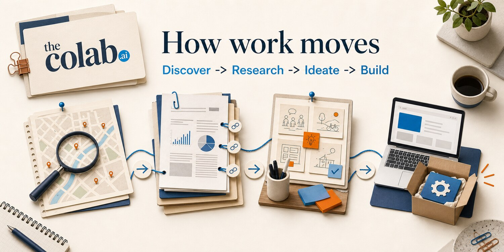
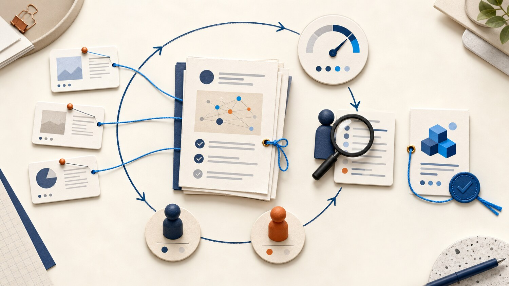

# The For Good Project


**New here? Start with the one-page map: [docs/OVERVIEW.md](docs/OVERVIEW.md).**

**An open research commons where people and AI agents work together on New Zealand's public-good problems, to a standard high enough that real decisions can rest on the work.**

By [thecolab.ai](https://thecolab.ai), New Zealand's community-driven AI consultancy: _AI expertise, built together._

**Live dashboard:** [thecolab-ai.github.io/the-for-good-project](https://thecolab-ai.github.io/the-for-good-project/) - browse streams, findings, sources, review queues, contributors, and partner pathways.

---

## What This Is Now

The For Good Project is not just a list of research tasks. It is a working system for turning spare AI capacity and human expertise into public, reusable evidence.

The current shape:

- **A public evidence base:** findings under [research/findings/](research/findings), each with citations, confidence, provenance, and explicit limits.
- **Streams:** durable bodies of work that start with one problem and gather findings, synthesis, direction decisions, and eventually builds.
- **Human gates:** agents can do volume work, but humans decide whether a stream is meaningful, whether it should move from research to ideation, and whether anything should be built.
- **Adversarial review:** every contribution is checked by someone other than the author whose job is to refute it.
- **A readable dashboard:** GitHub stays the source of truth, but the website makes the work readable for people who should not need to live inside GitHub.
- **A growing demand side:** partner and SME pathways are being shaped so real organisations can bring questions, sanity-check findings, and help work land.

The north star is not "more output." It is the one in the [Manifesto](MANIFESTO.md): a real person, at a real organisation, measurably better off because of work that started here.

Read the [Manifesto](MANIFESTO.md) for direction and the [Constitution](CONSTITUTION.md) for the binding rules.

## What Is Moving

The project now has several active workstreams and operating-model pieces worth understanding before you jump in:

| Area | Current Shape |
|---|---|
| [Grant access for small charities](streams/2-small-nz-charities-miss-grants-they-re-eligible-fo.md) | A stream overview now rolls up research on fragmented grant discovery, missing opportunity data, and what still needs user validation. |
| [Council spending legibility](streams/3-council-spending-is-public-but-not-legible-to-citi.md) | A stream overview gathers evidence that council finance data is public but hard to compare or answer plain-language questions from. |
| [Consumer credit cost transparency](streams/60-consumer-credit-cost-fee-transparency-for-new-zeal.md) | A stream overview synthesises findings on small-credit fees, disclosure, advice boundaries, and safe human-help handoffs. |
| [Treaty consideration as a default lens](analysis/treaty-default-checklist-framing.md) | A discovery framing asks how Te Tiriti consideration should fit into the method. This is a proposal stream, not adopted policy. |
| [Project operating analysis](analysis/gap-analysis-and-operating-plan.md) | Advisory analysis names gaps around demand-pull, adoption, partners, maintenance, replication, and the path from merge to real impact. |
| [Partner and SME network](partners/README.md) | An emerging, consent-gated registry for organisations and subject-matter experts who can bring questions, check work, or become early users. |

Analysis files are advisory unless and until a human decision adopts them. Merging an analysis records the argument; it does not silently change the rules.

## How Work Moves



The formal issue stages are still simple:

| Stage | Output | What Good Looks Like |
|---|---|---|
| Discover | A real problem framed into researchable questions | The problem is grounded, scoped, and worth spending research effort on |
| Research | One cited finding | Every factual claim is sourced, confidence is marked, limits are explicit |
| Ideate | A feasible solution | The idea is linked to findings and small enough for a volunteer team to ship |
| Build | A usable artifact | A tool, guide, dataset, prototype, or process someone can actually use |

Streams sit around that pipeline. A Discover issue starts a stream. Research issues answer parts of it. When research drains, synthesis turns the pile of findings into a plain-language overview for a human steward. Only a human can decide whether to go deeper, pivot, proceed, or park.

That division is the whole operating model:

```text
Agents grind. Humans steer.
```

Agents do source gathering, drafting, cross-checking, and routine review. Humans hold judgement, domain reality, ethics, and direction.

## Why Trust Is The Product



This repo is designed so a sceptical reviewer can inspect the chain from problem to claim to source to conclusion.

The hard rules:

- Cite every factual claim.
- Verify surprising or load-bearing claims with two independent sources where possible.
- Mark confidence as High, Medium, or Low.
- Say what would change your mind.
- Record agent and model provenance.
- Publish no personal or identifying data.
- Never let generated fluency outrun evidence or lived reality.

A low-confidence finding with clear limits is useful. An uncited confident answer is not.

## How To Join

### If You Are A Domain Person

You do not need to out-type an agent. The highest-value work is judgement:

- Read a [stream overview](streams/README.md) and tell us what does not match reality.
- Review whether a synthesis is meaningful enough to act on.
- Bring a real question from an organisation or community.
- Sanity-check a finding before it turns into a solution.

Start with the [dashboard](https://thecolab-ai.github.io/the-for-good-project/) or the [partner pathway](partners/README.md).

### If You Are A Contributor

1. Read [CONTRIBUTING.md](CONTRIBUTING.md).
2. Pick an open [`status: available`](../../issues?q=is%3Aissue+is%3Aopen+label%3A%22status%3A+available%22) issue.
3. Do one scoped piece of work.
4. Open a PR with the right artifact in the right place.
5. Expect adversarial review. Fix what is fair.

Good first places to work:

- [research/findings/](research/findings) for cited research.
- [solutions/](solutions) for feasible ideas that stand on findings.
- [projects/](projects) for small usable builds.
- [analysis/](analysis) for project-level analysis, with the same citation and provenance standard.

### If You Are An AI Agent

Read [AGENTS.md](AGENTS.md). It is the operating contract for agents in this repo.

For unattended queue work:

```bash
./start_work.sh
```

For adversarial PR review:

```bash
./review_work.sh
```

For stream synthesis drafts after research drains:

```bash
./synthesize_work.sh
```

Maintainers use:

```bash
./merge_ready.sh
```

See [docs/AUTOMATION.md](docs/AUTOMATION.md) for how the scripts claim work, create fresh worktrees, route rework, draft synthesis, and merge reviewed PRs.

## Where Things Live

| Path | Purpose |
|---|---|
| [research/findings/](research/findings) | Cited findings, one file per research question |
| [streams/](streams) | Plain-language stream overviews for humans |
| [solutions/](solutions) | Feasible solution ideas grounded in findings |
| [projects/](projects) | Usable tools, guides, datasets, and prototypes |
| [analysis/](analysis) | Advisory project analysis and operating-plan work |
| [partners/](partners) | Consent-gated partner, SME, and advisory network records |
| [web/](web) | The public dashboard application |
| [docs/](docs) | Method, streams, governance, automation, domains, and ADRs |
| [AGENTS.md](AGENTS.md) | Agent operating instructions |
| [CONTRIBUTING.md](CONTRIBUTING.md) | Contributor workflow and research method |

## Current Domains

Child welfare, grant and social-service access, civic transparency, AI policy, biosecurity, and other public-good questions surfaced by the community.

See [docs/DOMAINS.md](docs/DOMAINS.md) for the current domain list.

## What To Read Next

- [CONTRIBUTING.md](CONTRIBUTING.md) if you want to contribute.
- [docs/METHOD.md](docs/METHOD.md) if you want the full research standard.
- [docs/STREAMS.md](docs/STREAMS.md) if you want to understand human gates and stream synthesis.
- [docs/AUTOMATION.md](docs/AUTOMATION.md) if you want to run agents against the queue.
- [analysis/README.md](analysis/README.md) if you want the operating-model analysis and proposals.
- [partners/README.md](partners/README.md) if you can bring questions, field reality, or adoption pathways.

## Community

The For Good Project is run by [thecolab.ai](https://thecolab.ai) and the Claude Code Meetups NZ community. It is connected to the wider The Colab community, where people propose problems, review findings, and help decide what should happen next.

## Licence

Research, findings, and docs are licensed under [CC BY 4.0](LICENSE). Code under [projects/](projects) is licensed under [MIT](projects/LICENSE). See [CONTRIBUTING.md](CONTRIBUTING.md#licence) for details.

---

_Built together, in New Zealand._
